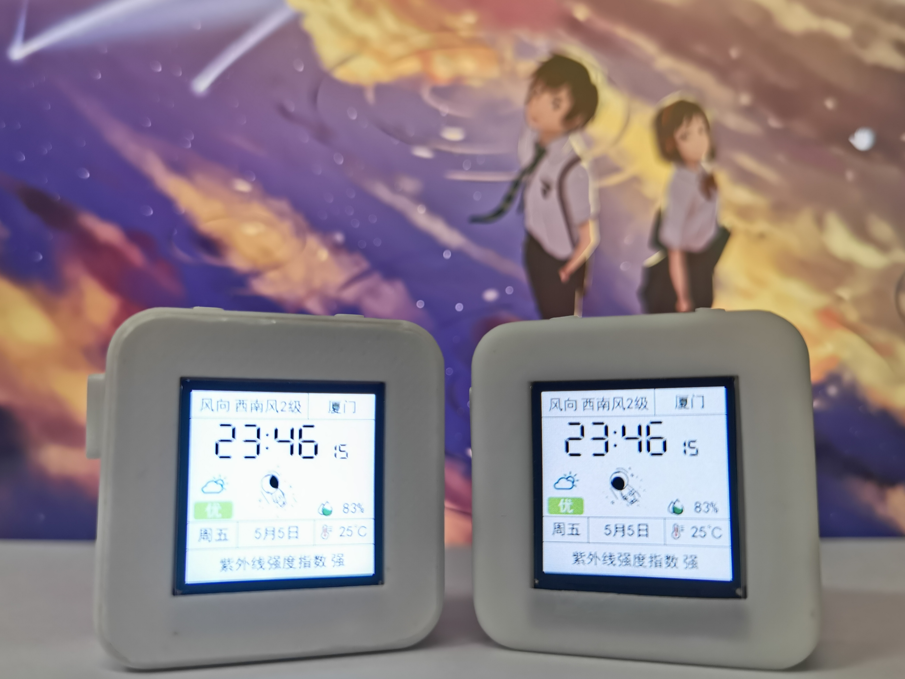

# 基于ESP32的情侣小电视
## 0.关于本项目
本项目是个人的第一个软硬件项目，经过了约两个月断断续续的开发完成了现在的版本，其中PCB和外壳完全由自己设计，软件部分的代码因为时间的原因没有按照原计划进行，而是在B站up主xutoubee的基础上进行了修改。本项目的原理图和PCB基于嘉立创eda绘制，并在嘉立创平台上打样；外壳模型使用SketchUp2019设计；代码基于PlatformIO的Arduino框架开发。  
该小电视目前具备的功能有：天气信息显示、电量显示、按键控制切换动画和配网重启。欢迎在本人的基础上实现更多的功能。
## 1.硬件打样说明
最新版本的PCB制板文件在Hardware/情侣小电视V1.2目录下，可在嘉立创平台上进行免费打样

最新版本的外壳文件在3D Model文件夹下，需要注意的是：如果不使用fdm打印机而使用光固化打印机，请选择高精度文件

## 2.固件编译说明
本项目基于VSCode上的PlatformIO插件开发，工程文件放置在Software文件夹下，复制到自己本地的PlatformIO工程目录下即可打开

编译生成的固件以及其他相应固件在Firmware文件夹下，可通过乐鑫官方的烧录软件进行烧录
## 3.元件采购说明
绝大部分的元器件都可以在立创商城购买到，**注意原理图中的AMS1117芯片要换成BL9110芯片**  
本人采购的电池型号为602530
## 4.产品使用说明
1.左侧的开关控制小电视开关机，仅关机状态可充电，开机状态可烧录  
2.左按钮按第一下配网，按第二下重启；右按钮切换显示动画  
3.第一次使用/左按钮按下/网络连接失败的情况下都会弹出配网页面，分别输入网络名称、密码、所在城市后点击保存，小电视会自动重启  
## 持续更新中...
