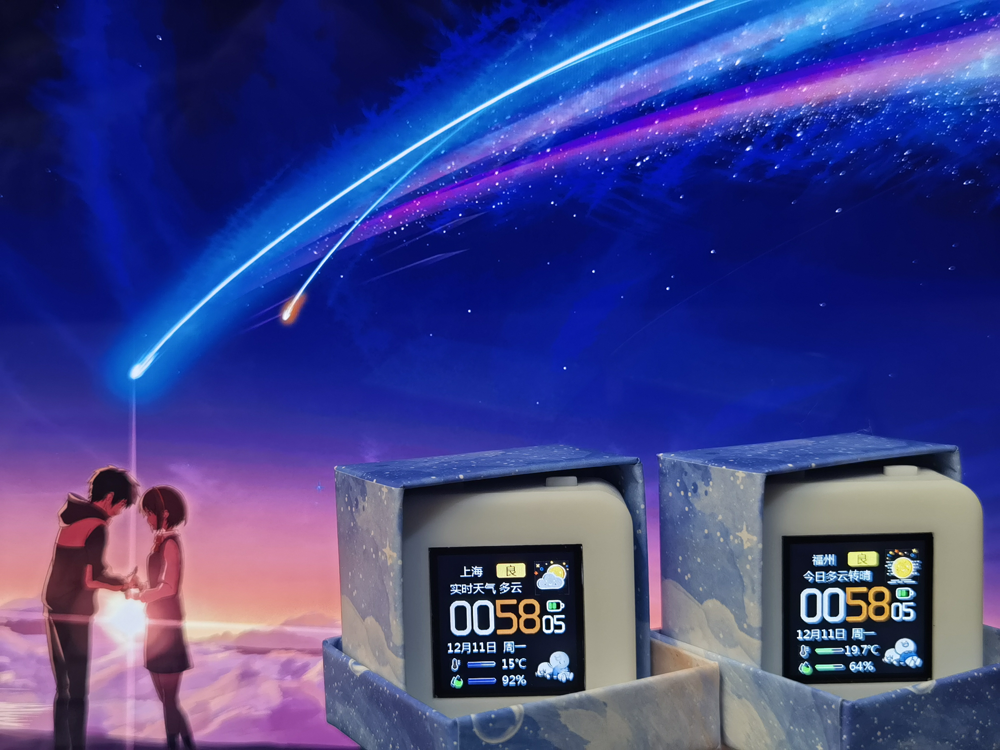
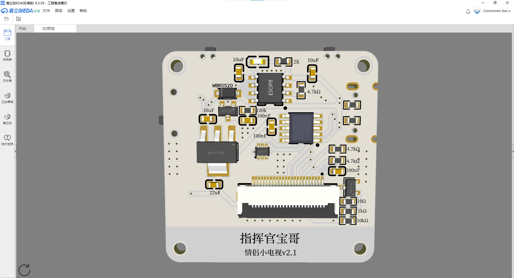
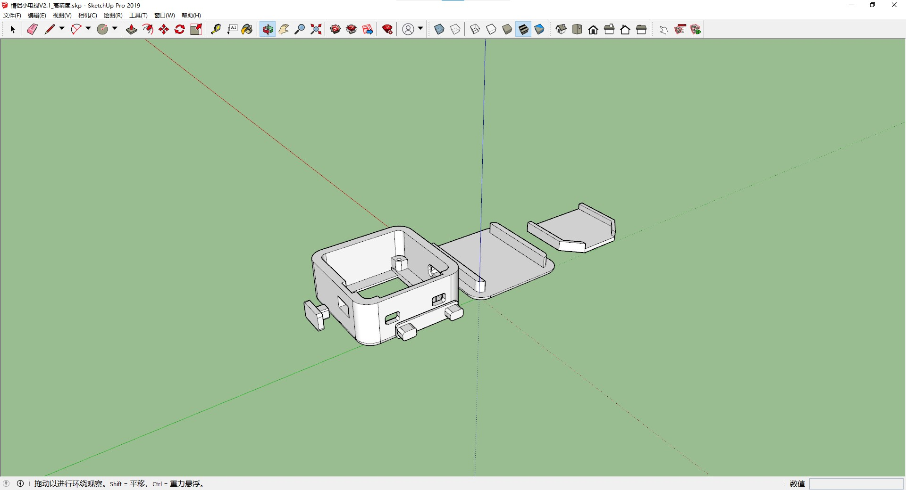
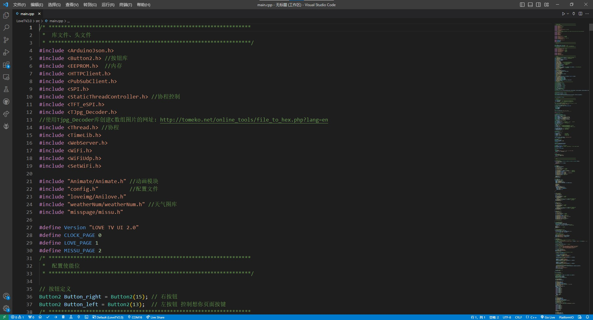

# 基于ESP32的情侣小电视
## 0.关于本项目
本项目是个人的第一个软硬件项目，经过了约两个月断断续续的开发完成了现在的版本，其中PCB和外壳完全由自己设计，软件部分的代码在B站up主指针阿飞的基础上进行了修改。本项目的原理图和PCB基于嘉立创eda绘制，并在嘉立创平台上打样；外壳模型使用SketchUp2019设计；代码基于VScode上的插件PlatformIO进行开发。  
该小电视目前具备的功能有：天气时钟、电量显示、纪念日页、情侣互动、动画切换、亮度调节、快速配网。欢迎在本人的基础上实现更多的功能。
## 1.硬件打样说明
最新版本的PCB制板文件在Hardware/情侣小电视V2.1目录下，可在嘉立创平台上进行免费打样

最新版本的外壳文件在3D Model文件夹下，需要注意的是：如果不使用fdm打印机而使用光固化打印机，请选择高精度文件，二代小电视请选择2.0版本的外壳。

## 2.固件编译说明
烧录前请先在VScode上配置好PlatformIO插件，本项目最新的代码文件压缩包为Software文件夹下的LoveTV2.0.zip文件，解压后复制到自己本地的PlatformIO工程目录下即可打开。

编译生成的固件以及其他相应固件在Firmware文件夹下，可通过乐鑫官方的烧录软件进行烧录
## 3.元件采购说明
绝大部分的元器件都可以在立创商城购买到，**注意原理图中的AMS1117芯片要换成BL9110芯片**  
本人采购的电池型号为602530，嘉立创上买不到的元器件可以参考以下链接购买：[显示屏链接](https://item.taobao.com/item.htm?id=565306950948&spm=a1z0d.6639537/tb.1997196601.183.3c317484soud9F&skuId=4731850057790) [Type-c链接](https://item.taobao.com/item.htm?id=573090887123&spm=a1z0d.6639537/tb.1997196601.4.3c317484soud9F) [主控芯片链接](https://item.taobao.com/item.htm?id=634424428305&skuId=4543431189229&spm=a1z0d.6639537/tb.1997196601.12.3c317484soud9F) [FPC连接器链接](https://item.taobao.com/item.htm?id=552629356951&spm=a1z0d.6639537/tb.1997196601.20.3c317484soud9F&skuId=4983175264945) [滑动开关链接](https://item.taobao.com/item.htm?id=569513203579&spm=a1z0d.6639537/tb.1997196601.261.3c317484soud9F)  
## 4.产品使用说明
（1.x版本）  
1.左侧的开关控制小电视开关机，仅关机状态可充电，开机状态可烧录  
2.左按钮按第一下配网，按第二下重启；右按钮切换显示动画  
3.第一次使用/左按钮按下/网络连接失败的情况下都会弹出配网页面，请在手机WiFi中找到并连接“情侣小电视”，分别输入网络名称、密码、所在城市后点击保存，小电视会自动重启  
（2.x版本）  
1.左侧开关控制小电视开关机，插上电源线即可充电，开机状态可烧录  
2.单击左按钮跳出情侣日页面，双击左按钮发送想你啦，长按左按钮重启；单击右按钮调节屏幕亮度，双击右按钮切换屏幕动画，长按右按钮配网  
3.第一次使用/右按钮长按/网络连接失败的情况下都会弹出无网络提示，请在手机WiFi中找到并连接“情侣小电视”，分别输入网络名称、密码、所在城市后点击保存，小电视会自动重启  
## 2023.12.07更新说明
1.小电视的硬件更新到了2.1.1版本，把microusb接口换成了更常用的type-c  
2.小电视的外壳更新到了2.0版本，适配新的type-c的接口，更美观  
3.小电视的代码更新到了2.0版本，能够实现和对象互相通信  
